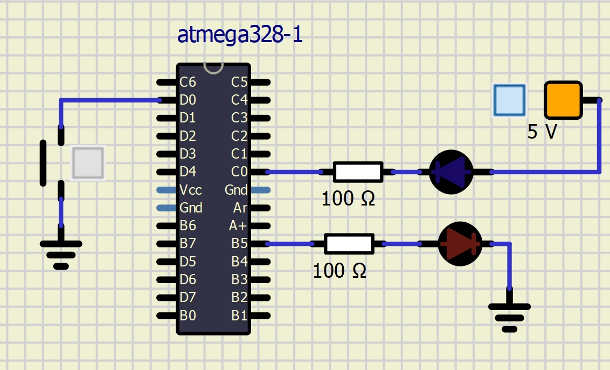

| **LED color** | **Supply voltage** | **LED current** | **LED voltage** | **Resistor value** |
| :-: | :-: | :-: | :-: | :-: |
| red | 5&nbsp;V | 20&nbsp;mA | 2&nbsp;V | 150 $$\Omega$$ |
| blue | 5&nbsp;V | 20&nbsp;mA | 2,2&nbsp;V |140 $$\Omega$$ |


## Part 2: Active-low and active-high LEDs

| **DDRB** | **Description** |
| :-: | :-- |
| 0 | Input pin |
| 1 | Output pin |

| **PORTB** | **Description** |
| :-: | :-- |
| 0 | Output low value |
| 1 | Output high value |

| **DDRB** | **PORTB** | **Direction** | **Internal pull-up resistor** | **Description** |
| :-: | :-: | :-: | :-: | :-- |
| 0 | 0 | Input | No | Tri-state, high-impedance |
| 0 | 1 | Input | Yes | Pxn will source current if ext. pulled low |
| 1 | 0 | Output | No | Output Low (Sink) |
| 1 | 1 | Output | No | Output High (Source) |


| **Port** | **Pin** | **Input/output usage?** |
| :-: | :-: | :-- |
| A | x | Microcontroller ATmega328P does not contain port A |
| B | 0 | Yes (Arduino pin 8) |
|   | 1 | Yes (Arduino pin 9) |
|   | 2 | Yes (Arduino pin 10) |
|   | 3 | Yes (Arduino pin 11) |
|   | 4 | Yes (Arduino pin 12) |
|   | 5 | Yes (Arduino pin 13) |
|   | 6 | NO (XTAL1) |
|   | 7 | NO (XTAL2) |
| C | 0 | Yes (Arduino pin A0) |
|   | 1 | Yes (Arduino pin A1) |
|   | 2 | Yes (Arduino pin A2) |
|   | 3 | Yes (Arduino pin A3) |
|   | 4 | Yes (Arduino pin A4) |
|   | 5 | Yes (Arduino pin A5) |
|   | 6 | Yes but must be set in fuse not use in arduino (Arduino pin RESET)  |
|   | 7 | Microcontroller ATmega328P does not contain this pin |
| D | 0 | Yes (Arduino pin RX<-0) |
|   | 1 | Yes (Arduino pin TX->1) |
|   | 2 | Yes (Arduino pin 2) |
|   | 3 | Yes (Arduino pin 3) |
|   | 4 | Yes (Arduino pin 4) |
|   | 5 | Yes (Arduino pin 5) |
|   | 6 | Yes (Arduino pin 6) |
|   | 7 | Yes (Arduino pin 7) |

## Lab assignment "LED example" main.c

```c
#define LED_GREEN   PB5
#define LED_RED     PC0
#define BUTTON     	PD0
#define BLINK_DELAY 250

#ifndef F_CPU
#define F_CPU 16000000
#endif


#include <util/delay.h>
#include <avr/io.h>


int main(void){

    /* GREEN LED */
    DDRB = DDRB | (1<<LED_GREEN);
    PORTB = PORTB & ~(1<<LED_GREEN);

	/* RED LED */
	DDRC = DDRC | (1<<LED_RED);
	PORTC = PORTC & ~(1<<LED_RED);

	/* BUTTON */
	DDRD = DDRD & ~(1<<BUTTON);
	PORTD = PORTD | (1<<BUTTON);

    while (1){

        _delay_ms(BLINK_DELAY);
		if(bit_is_clear(PIND, 0)){
			PORTB = PORTB ^ (1<<LED_GREEN);
			PORTC = PORTC ^ (1<<LED_RED);
		}

    }

    return 0;
}

```




## Experiments on your own

1. Connect five LEDs to the microcontroller, modify `02-leds` code, and program an application that will ensure that only one of LED is switched on at a time according in [Knight Rider style](https://www.youtube.com/watch?v=w-P-2LdS6zk).

2. Simulate the Knight Rider application in SimulIDE.

Extra. Program the [PWM generator](https://www.analogictips.com/pulse-width-modulation-pwm/) using the delay library. Let the duty cycle of the PWM signal be changed continuously and the signal is connected to one of the LEDs. How does a change of duty cycle affect the brightness of an LED?


## Lab assignment

1. LED example. Submit:
    * Tables for DDRB, PORTB, and their combination,
    * Table with input/output pins available on ATmega328P,
    * C code with two LEDs and a push button,
    * Screenshot of SimulIDE circuit.

2. Knight Rider application. Submit:
    * C code.

The deadline for submitting the task is the day before the next laboratory exercise. Use [BUT e-learning](https://moodle.vutbr.cz/) web page and submit a single PDF file.
