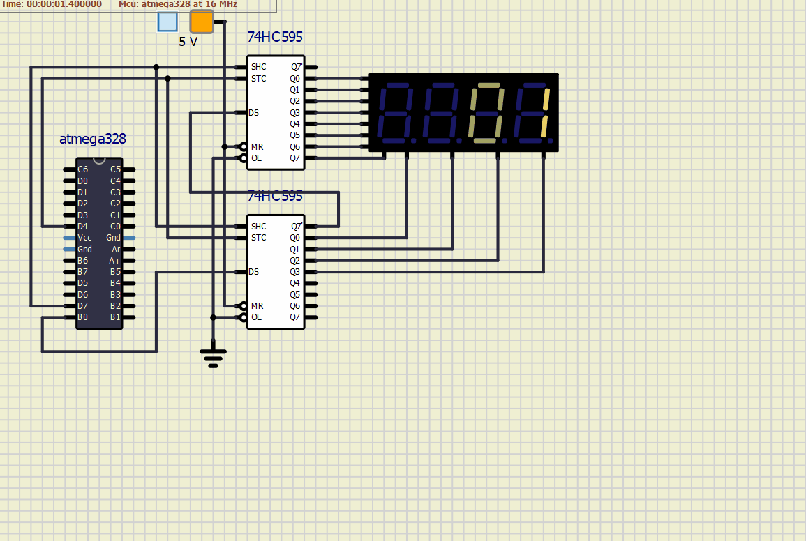

# Lab 5: Display devices, 7-segment display

   | **Digit** | **A** | **B** | **C** | **D** | **E** | **F** | **G** | **DP** |
   | :-: | :-: | :-: | :-: | :-: | :-: | :-: | :-: | :-: |
   | 0 | 0 | 0 | 0 | 0 | 0 | 0 | 1 | 1 |
   | 1 | 1 | 0 | 0 | 1 | 1 | 1 | 1 | 1 |
   | 2 | 0 | 0 | 1 | 0 | 0 | 1 | 0 | 1 |
   | 3 | 0 | 0 | 0 | 0 | 1 | 1 | 0 | 1 |
   | 4 | 1 | 0 | 0 | 1 | 1 | 0 | 0 | 1 |
   | 5 | 0 | 1 | 0 | 0 | 1 | 0 | 0 | 1 |
   | 6 | 0 | 1 | 0 | 0 | 0 | 0 | 0 | 1 |
   | 7 | 0 | 0 | 0 | 1 | 1 | 1 | 1 | 1 |
   | 8 | 0 | 0 | 0 | 0 | 0 | 0 | 0 | 1 |
   | 9 | 0 | 0 | 0 | 0 | 1 | 0 | 0 | 1 |





# DU 5: Table with snake definition

   | **POSITION** | **A** | **B** | **C** | **D** | **E** | **F** | **G** | **DP** |
   | :-: | :-: | :-: | :-: | :-: | :-: | :-: | :-: | :-: |
   | 0 | 0 | 1 | 1 | 1 | 1 | 1 | 1 | 1 |
   | 1 | 1 | 0 | 1 | 1 | 1 | 1 | 1 | 1 |
   | 2 | 1 | 1 | 0 | 1 | 1 | 1 | 1 | 1 |
   | 3 | 1 | 1 | 1 | 0 | 1 | 1 | 1 | 1 |
   | 4 | 1 | 1 | 1 | 1 | 0 | 1 | 1 | 1 |
   | 5 | 1 | 1 | 1 | 1 | 1 | 0 | 1 | 1 |

```C
// redefine table of segnemt value to generate snake
uint8_t segment_value[] = {
	0b01111111,
    0b10111111,
    0b11011111,
    0b11101111,
    0b11110111,
    0b11111011
};
```

## Lab assignment

1. Preparation tasks (done before the lab at home). Submit:
    * Table with segments values for display 0 to 9 on a common anode 7-segment display,
    * In your words, describe the difference between Common Cathode and Common Anode 7-segment display.

2. 7-segment library. Submit:
    * Listing of library source file `segment.c`,
    * Listing of decimal counter application `main.c` (at least two-digit decimal counter, ie. from 00 to 59),
    * Screenshot of SimulIDE circuit.

3. Snake. Submit:
    * Look-up table with snake definition,
    * Listing of your snake cycling application `main.c`.
