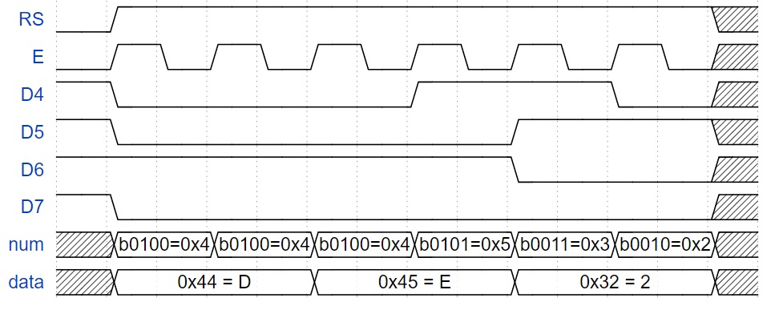
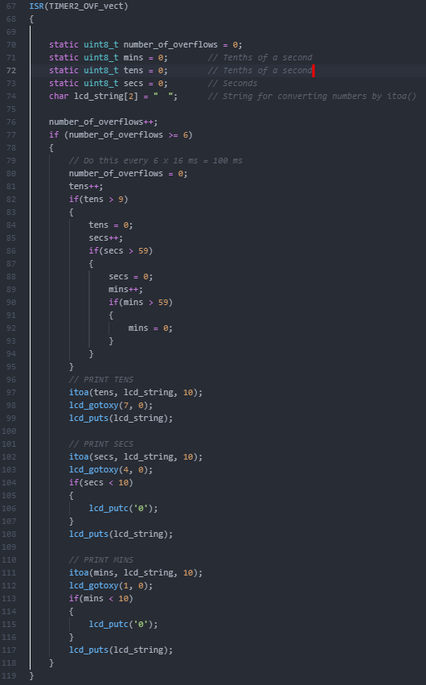
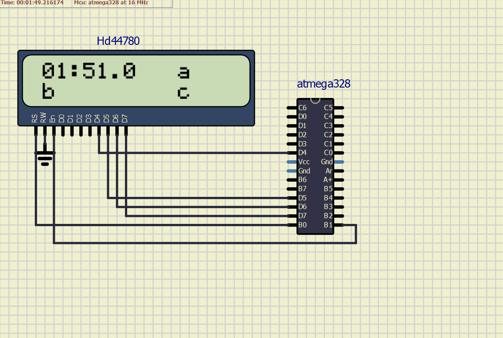
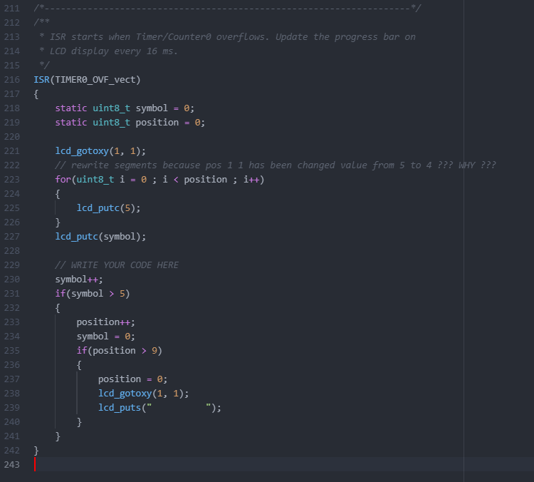
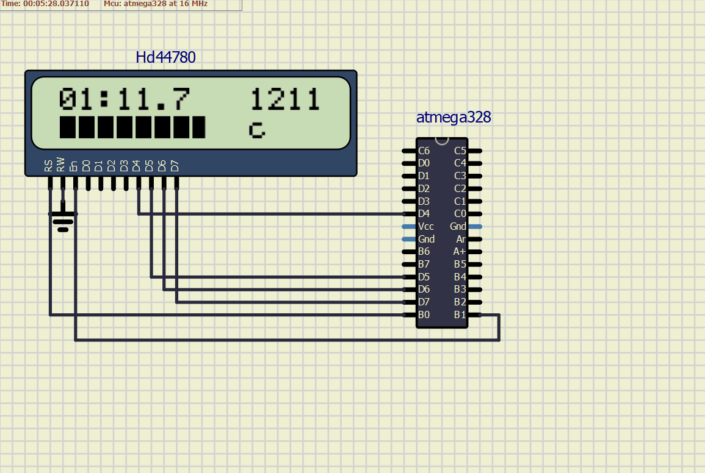

# Lab 6: Display devices, LCD display

| **LCD signal(s)** | **AVR pin(s)** | **Description** |
| :-: | :-: | :-- |
| RS | PB0 | Register selection signal. Selection between Instruction register (RS=0) and Data register (RS=1) |
| R/W | GND | READ/WRITE mode. (R/W=1) read mode, (R/W=0) write mode |
| E | PB1 | Enable. This loads the data into the HD44780 on the falling edge |
| D[3:0] | NC | Data lines (not used in 4-bit mode) |
| D[7:4] | PD[7:4] | Data lines |


| **CHAR** | **value of char by ASCII** | **CHAR** | **value of char by ASCII** | **CHAR** | **value of char by ASCII** |
|:-:|:-:|:-:|:-:|:-:|:-:|
|	a	|	97	|	A	|	65	|	0	|	48	|
|	b	|	98	|	B	|	66	|	1	|	49	|
|	c	|	99	|	C	|	67	|	2	|	50	|
|	d	|	100	|	D	|	68	|	3	|	51	|
|	e	|	101	|	E	|	69	|	4	|	52	|
|	f	|	102	|	F	|	70	|	5	|	53	|
|	g	|	103	|	G	|	71	|	6	|	54	|
|	h	|	104	|	H	|	72	|	7	|	55	|
|	i	|	105	|	I	|	73	|	8	|	56	|
|	j	|	106	|	J	|	74	|	9	|	57	|
|	k	|	107	|	K	|	75	|		|		|
|	l	|	108	|	L	|	76	|		|		|
|	m	|	109	|	M	|	77	|		|		|
|	n	|	110	|	N	|	78	|		|		|
|	o	|	111	|	O	|	79	|		|		|
|	p	|	112	|	P	|	80	|		|		|
|	q	|	113	|	Q	|	81	|		|		|
|	r	|	114	|	R	|	82	|		|		|
|	s	|	115	|	S	|	83	|		|		|
|	t	|	116	|	T	|	84	|		|		|
|	u	|	117	|	U	|	85	|		|		|
|	v	|	118	|	V	|	86	|		|		|
|	w	|	119	|	W	|	87	|		|		|
|	x	|	120	|	X	|	88	|		|		|
|	y	|	121	|	Y	|	89	|		|		|
|	z	|	122	|	Z	|	90	|		|		|


## Picture of time signals for DE2


Created by https://wavedrom.com/editor.html

```
{signal: [
  {name: 'RS', wave: '01...........x'},
  {name: 'E', wave: '0101010101010x'},
  {name: 'D4', wave: '10.....1...0.x'},
  {name: 'D5', wave: '10.......1...x'},
  {name: 'D6', wave: '1........0...x'},
  {name: 'D7', wave: '10...........x'},
  {name: 'num', wave: 'x2.2.2.2.2.2.x', data: ['b0100=0x4', 'b0100=0x4', 'b0100=0x4', 'b0101=0x5', 'b0011=0x3', 'b0010=0x2']},
  {name: 'data', wave: 'x2...2...2...x', data: ['0x44 = D', '0x45 = E', '0x32 = 2']},
]}
```

## Stopwatch. Submit






## Part 3: Library for HD44780 based LCDs


   | **Function name** | **Function parameters** | **Description** | **Example** |
   | :-- | :-- | :-- | :-- |
   | `lcd_init` | `LCD_DISP_OFF`<br>`LCD_DISP_ON`<br>`LCD_DISP_ON_CURSOR`<br>`LCD_DISP_ON_CURSOR_BLINK` | Display off&nbsp;&nbsp;&nbsp;&nbsp;&nbsp;&nbsp;&nbsp;&nbsp;&nbsp;&nbsp;&nbsp;&nbsp;&nbsp;&nbsp;&nbsp;&nbsp;&nbsp;&nbsp;&nbsp;&nbsp;&nbsp;&nbsp;&nbsp;&nbsp;&nbsp;&nbsp;&nbsp;&nbsp;&nbsp;&nbsp;&nbsp;&nbsp;&nbsp;&nbsp;&nbsp;&nbsp;&nbsp;&nbsp;&nbsp;&nbsp;&nbsp;&nbsp;&nbsp;&nbsp;&nbsp;<br>&nbsp;<br>&nbsp;<br>&nbsp; | `lcd_init(LCD_DISP_OFF);`<br>&nbsp;<br>&nbsp;<br>&nbsp; |
   | `lcd_clrscr` | `void` | Clear display and set cursor to home position. | `lcd_clrscr();` |
   | `lcd_gotoxy` | `uint8_t x`<br>`uint8_t y` | Set cursor to specified position.  | `lcd_gotoxy(0, 0);` |
   | `lcd_putc` | `char c` | Display character at current cursor position.  | `lcd_putc(48);` |
   | `lcd_puts` | `const char *s` | Display string without auto linefeed. | `lcd_puts("Hello World!");` |
   | `lcd_command` | `uint8_t cmd` | Send LCD controller instruction command. | `lcd_command(1 << LCD_CGRAM);` |
   | `lcd_data` | `uint8_t data` | Send data byte to LCD controller. | `lcd_data(customChar[i]);` |


## Stopwatch. Submit






## Lab assignment

1. Preparation tasks (done before the lab at home). Submit:
   * Table with LCD signals,
   * ASCII values.

2. HD44780 communication. Submit:
   * Picture of time signals between ATmega328P and HD44780 (LCD keypad shield) when transmitting data `DE2`.

3. Stopwatch. Submit:
   * Listing of `TIMER2_OVF_vect` interrupt routine with complete stopwatch code (`minutes:seconds.tenths`) and square value computation,
   * Screenshot of SimulIDE circuit when "Power Circuit" is applied.

4. Progress bar. Submit:
   * Listing of `TIMER0_OVF_vect` interrupt routine with a progress bar,
   * Screenshot of SimulIDE circuit when "Power Circuit" is applied.
