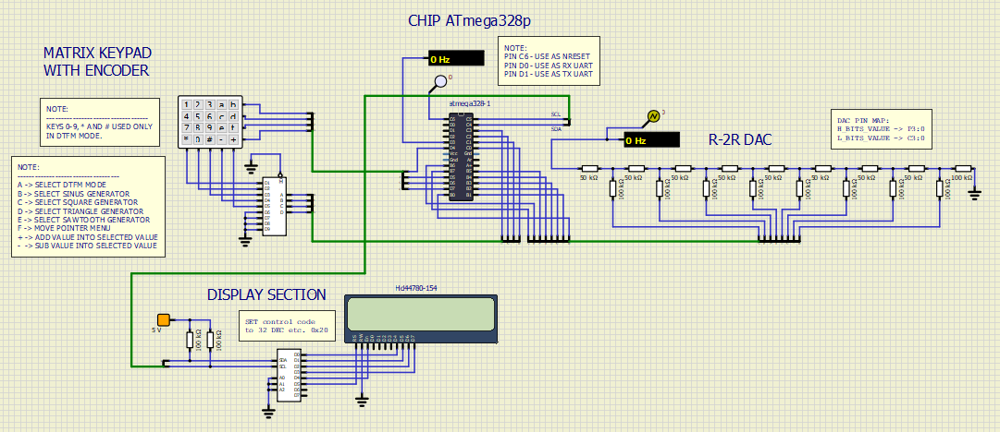

# DAC převodník typu R-2R, generator funkcí

### Projekt zpracován: [Tomáš Vymazal](https://github.com/vymaztom)

[Odkaz na GitHub projekt](https://github.com/vymaztom/Digital-electronics-2/tree/master/Labs/Projekt)

### Cíl projektu

Popis funkce R-2R ladder digitálně analogového převodníku (Digital to Analog Converter, DAC). Aplikace generátoru analogového signálu využívající alespoň 8bitový DAC; několik přednastavených typů signálů; displej; ovládání pomocí klávesnice 4x3; (volitelně možnost generování tónu DTMF, Dual-Tone Multiple Frequencies); odesílání zajímavých informací o stavu aplikace na UART.


## Popis hardwaru

Hardwarová část projektu je rozdělena několik částí. jednotlivé části jsou logické bloky, kde kažká má svoji určitou úlohu. Hlavní níže nepopisovanou částí je MCU, ta obsahuje mikrokontrolér ATmega328-P.

### Blok DAC převodníku typu R-2R


Převodník je poskládán z rezistorové sítě. Ovládá se pomocí 8 vstupních pinů. Každý pin přídává do výsledného signálu jinou hodnotu amplitudy pro DC signál. Při rychlé změněn vstupních hodnot můžeme z tohoto DC signálu vytvořit jiný, například sínusodní průběh.

### Blok Klavesnice


Obvod klávesnice potřebuje část pinu, které jsou nastaveny jako výstupní piny a část pinů, které jsou nastaveny jako vstupní. Z vnitřího zapojení klávesnice totož plyne, že při stisku klývesy dojde pouze k propojení vodičů, a to vodiče definující řádek a sloupec. Proto je potřeba stis jedné klávesy detekovat nastevením vysoké hodnty na výstupním pinu a hledat, kam se nám promítne na výstupu. Pořadí výstupního pinu a vstupního pak následně jednoznačně definuje stisknutou klávesnici.

Tento způsob vyčítání je doplněn o encodér na výstupu z klávesnice, díky kterému můžeme, snížit počet použitých pinů, v našem případě z 5 na 4, pro méně pinů by zapoení nemělo smysl protože by nedosšlo k úspoře pinu. Toto zapojení má jednu obrovskou výhodu. Tou je že binární hodnota ABCD nám rovnou definuje číslo sloupce tedy pokud zmáčkneme klávesu +, která se nachází v 5 sloupci. Encodér vrátí hodnotu 0101 (ABCD), což po třevodu do dekadické soustavy je hodnota 5.

### Blok displeje


Pro tento projekt je použitý klasický LCD display s hd44780. Rozšížení toho projetu je přípojení diplaje na I2C/TWI sběrnici, díky tomu můžeme display ovládat pouze pomocí 2 pinů na MCU. Nastavená adresa TWI sběrnice pro slave (nejsem rasista!!! ; otrok != černý, viz historie Římá) zařízení je 32 DEC, neboli 20 HEX. K tomu zapojení bylo potřeba vytvořit pomocnou knihovnu, bude posána níže.


### Kompletní schéma zapojení


Po popsání jednotlivých funkčních bloků, není potřeba k celkovéu schéma nic dodávat, protože nám pouze říká, kam jsou jednlitvé ovládací sběrnice přípojeny, respektve k terým pinům MCU.


## Popis kódu a simulace

Aplikace je ovládaná pomocí klávesnice. Pomocí znaků A až F můžeme volit tvar generovaného signálu, který signál odpovídá jaké klávese je popsán níže.

 * A - DTFM
 * B - Sinus
 * C - PWM s = 0,5
 * D - Trojúhelníkový signál
 * E - Pilovitý signál
 * F - přepíná mezi změnou amplitudy a frekvencí
 * "+" - přičte 1 ke zvolené hodnotě
 * "-" - odečte 1 od zvolené hodnoty

**Poznámka: klávesy 0 až 9, # a * jsou aktivní pouze v modu DTFM**

### Struktura programu

Program může být rozčleněn do dvou bloků. Prvním je smyčka loop, druhou částí je přerušení. V nekonečné smyčce se pouze provádí vyčítí z klávesnice, a výpis na UART. V přerušení se nachází switch, který podle zvoleného modu generuje data pro R-2R převodník.

#### Glokové schéma main souboru


#### Glokové schéma Timeru 1 v CTC módu

Program využívá CTC s nastavenou hodnotou OCR1A = 400, což definuje přerušení s frekvencí 40 kHz neboli každých 25 us, z toho důvodu generování signálu nesmí být výpočetně náročné proto je nežádou volat opakovaně funkce, protože samotné volání je výpočetně náročnější než vypsání celé funkce znovu. proto se zde může stát, že se kod opakuje a moc dlouhý.  


#### Stavová struktura definující tvar generovaného signálu

 K přechodu mezi jednotlívymi tvary signálu dochází při čtení hodnot z klavesnice, jedino vyjímku tvoží skupina stavů na generování DTFM. Přechod mezi těmito stavy je popsán níže.


#### Výčítání hodnot z EEPROM a generování signálu o určité frekvenci

Pro každou zvolenou frekvenci je vypočtena jení perioda a to v počtu vzorků. Dále pak koeficient poměru, který udává poměr mezi zvolenou frekvecí a předpočítanými daty. Díky těmto dvoum parametrům můžeme bezproblému dopočítat pořadouvanou hodnotu pomocí kodu.

```c
// c_time_freq	- hodnota čítače od 0 do vypočtené period
// devide 		- poměr mezi vygenerovanou a pořadouvanou frekvencí.

uint8_t value = eeprom_read_byte((uint8_t*)(c_time_freq*devide));

/*
note: protože pracujeme s diskrétními hodnotamy, tak je potřeba celý devider
vynásobit konstandou, aby došlo co k nejmenší ztrátě informace. Při vyčítíní hodnoty
z eeprom je zase potřeba výsledek podělit konstantou, konstantu jsem zvolit tak aby
to byla mocnina 2 aby se dal výsledek snadno a rychle podělit (konstanta je 32)
*/
```  
#### Struktura knihoven

Aplikace pracuje z mnoha mnou napsanými knihovanmi jako jsou například:

* [TWI_LCD](library\TWI_LCD.c)
* [sinGeneratorEEPROM](library\sinGeneratorEEPROM.c)
* [FIFO](library\FIFO.c)

Aplikace dále pracuje s knihovanmi:

* GPIO
* twi
* uart

#### Dokumentace Doxygen

[Dokumentace k projektu](\doc\html)

## Video - Animace

#### DTFM


#### SINE


#### OTHER


## Zdroje

[1] https://sites.google.com/site/qeewiki/books/avr-guide/timers-on-the-atmega328
[2] https://github.com/tomas-fryza/Digital-electronics-2
[3] http://www.peterfleury.epizy.com/avr-software.html
